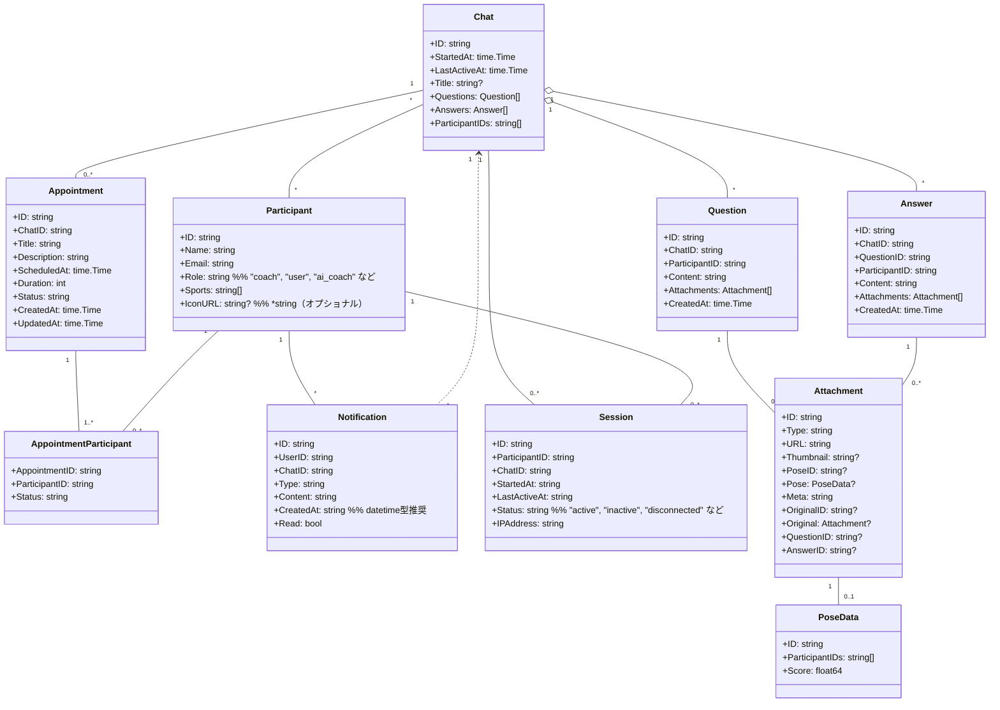
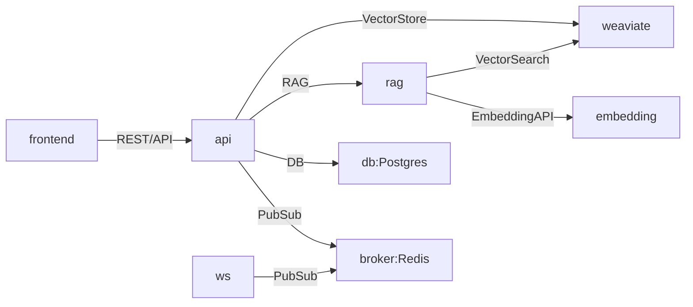

## AIコーチの回答生成について


- コーチの回答や過去のチャット履歴、関連ドキュメントをRAG（Retrieval-Augmented Generation）で検索・抽出し、その情報をもとにAI（大規模言語モデル）が回答を生成します。
- 具体的には、ユーザーからの質問やチャット文脈をもとに、まず関連するコーチの過去回答やナレッジベースを検索（retrieval）し、その内容をプロンプトに含めてAIが自然な回答文を生成（generation）します。
- これにより、AIコーチは実際のコーチの知見や過去のやりとりを活用した、より信頼性・一貫性の高い回答を返すことができます。
- RAGの導入により、AIの回答品質向上・パーソナライズ・ドメイン知識の反映が可能となります。


### ポーズ推定（Pose Estimation）とフォーム指導
- 人間の動画や画像から骨格（スケルトン）情報を抽出する「ポーズ推定（Pose Estimation）」技術を活用し、フォーム指導を行います。
- 具体的には、OpenPoseやMediaPipe Poseなどのライブラリを用いて、画像・動画からキーポイント（関節座標）やスケルトンデータを取得します。
- モデルの独自学習には多くのデータと高精度なアノテーションが必要なため、まずは抽出したポーズ情報（ベクトルデータ）と既存のフォーム指導ナレッジをRAG（Retrieval-Augmented Generation）的に組み合わせてAIによるアドバイス生成を行います。
- これにより、ユーザーの動作と理想的なフォームの類似度や特徴点の違いをもとに、パーソナライズされたフィードバックを提供します。

---

## ドメインモデル（クラス図）

以下は`class.md`で定義されたドメインモデルのMermaidクラス図です。



---
本リポジトリは、ドメイン駆動設計（DDD）およびオニオンアーキテクチャをベースに、マイクロサービスごとにコンテナ分割できる構成を推奨します。

---

## システム構成図（サービス間連携）




## リアルタイム通信設計まとめ

### チャットのリアルタイム通信設計

- チャット画面がアクティブな場合、クライアントは常にWebSocketサーバーに接続し、送信・受信ともにWSイベントでリアルタイム通信を行う。
- 送信側はWS経由でメッセージ送信。受信側がアクティブなら即時UI反映、非アクティブならDB保存＋OSプッシュ通知（APNs/FCM等）で通知。
- 受信者が次回アクティブになった時、DBから未読メッセージをfetchして同期する。
- REST APIのAdd系（例: AddQuestion）は主な操作では使われず、WS未接続時のフォールバックや管理用途など補助的な役割。

### pushとfetchの併用

- push（WebSocket等）：サーバー→クライアントへの能動的なリアルタイム通知。即時UI反映。
- fetch（REST等）：クライアント→サーバーへの明示的なデータ取得。整合性担保や再取得に利用。
- pushだけでは取りこぼしやズレのリスクがあるため、必要に応じてfetchで正規データを取得する。

---

## 推奨ディレクトリ構成

```
/api              # REST APIサービス（Goなど）
  /domain         # ドメイン層（エンティティ・値オブジェクト・集約・リポジトリIF・ドメインサービス）
  /application    # アプリケーション層（ユースケース・アプリケーションサービス・DTO）
  /infrastructure # インフラ層（DB実装・外部API・リポジトリ実装）
  /presentation   # プレゼンテーション層（HTTPハンドラ・ルーティング・認証）
  main.go         # エントリポイント
/frontend         # フロントエンド（Next.js, React等）
/db               # DBマイグレーション・DDL等
/ai               # AI/ML関連サービス
/pose-estimator   # 姿勢推定サービス

uml_component_diagram.md # アーキテクチャ図・UML
README.md                # このファイル
```

- サービスごとにディレクトリを分割し、各サービスは独立したコンテナとしてデプロイ可能です。
- 各サービス内でオニオンアーキテクチャのレイヤー分離を徹底します。
- 共通仕様やAPI設計はこのREADMEやuml_component_diagram.mdで統一管理してください。

