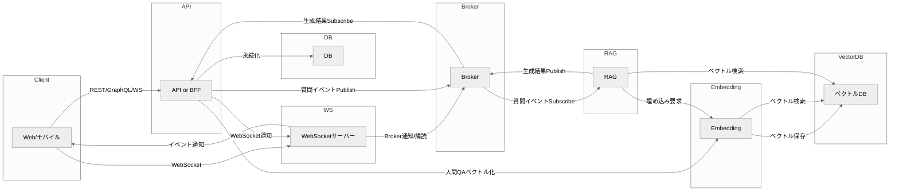

```mermaid
%%{init: {'theme':'neutral'}}%%
flowchart LR
    subgraph Client
        A[Web/モバイル]
    end
    subgraph API
        B[API or BFF]
    end
    subgraph Broker
        C[Broker]
    end
    subgraph RAG
        D[RAG]
    end
    subgraph Embedding
        F[Embedding]
    end
    subgraph VectorDB
        G[ベクトルDB]
    end
    subgraph DB
        E[DB]
    end
    subgraph WS
        H[WebSocketサーバー]
    end

    A -- REST/GraphQL/WS --> B
    A -- WebSocket --> H
    H -- イベント通知 --> A
    B -- WebSocket通知 --> H
    H -- Broker通知/購読 --> C
    B -- 質問イベントPublish --> C
    C -- 質問イベントSubscribe --> D
    D -- 生成結果Publish --> C
    C -- 生成結果Subscribe --> B
    B -- 永続化 --> E
    B -- 人間QAベクトル化 --> F
    F -- ベクトル保存 --> G
    D -- 埋め込み要求 --> F
    F -- ベクトル検索 --> G
    D -- ベクトル検索 --> G
```
