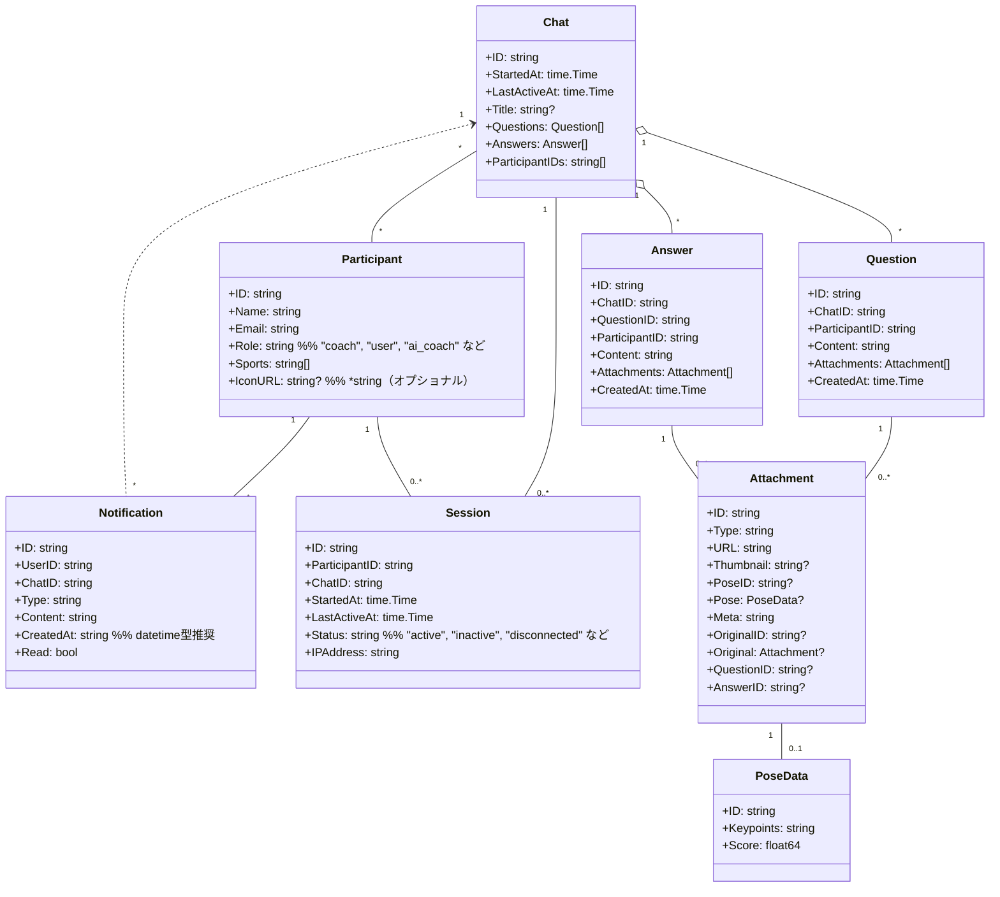

```mermaid
classDiagram
	class Chat {
		+ID: string
		+StartedAt: time.Time
		+LastActiveAt: time.Time
		+Title: string?
		+Questions: Question[]
		+Answers: Answer[]
		+ParticipantIDs: string[]
	}

    class Notification {
		+ID: string
		+UserID: string
		+ChatID: string
		+Type: string
		+Content: string
		+CreatedAt: string %% datetime型推奨
		+Read: bool
    }

	class Participant {
		+ID: string
		+Name: string
		+Email: string
		+Role: string %% "coach", "user", "ai_coach" など
		+Sports: string[]
		+IconURL: string? %% *string（オプショナル）
	}

	class Session {
	+ID: string
	+ParticipantID: string
	+ChatID: string
	+StartedAt: time.Time
	+LastActiveAt: time.Time
	+Status: string %% "active", "inactive", "disconnected" など
	+IPAddress: string
	}


	class Question {
		+ID: string
		+ChatID: string
		+ParticipantID: string
		+Content: string
		+Attachments: Attachment[]
		+CreatedAt: time.Time
	}
	class Answer {
		+ID: string
		+ChatID: string
		+QuestionID: string
		+ParticipantID: string
		+Content: string
		+Attachments: Attachment[]
		+CreatedAt: time.Time
	}
	class Attachment {
		+ID: string
		+Type: string
		+URL: string
		+Thumbnail: string? 
		+PoseID: string? 
		+Pose: PoseData? 
		+Meta: string 
		+OriginalID: string? 
		+Original: Attachment?
		+QuestionID: string? 
		+AnswerID: string? 
	}

    class PoseData {
		+ID: string
		+Keypoints: string
		+Score: float64
    }
	Chat "1" -- "0..*" Session

	Participant "1" -- "0..*" Session

	Participant "1" -- "*" Notification
    Chat "1" <.. "*" Notification

	Chat "*" -- "*" Participant
	Chat "1" o-- "*" Question 
	Chat "1" o-- "*" Answer
	Question "1" -- "0..*" Attachment
	Answer "1" -- "0..*" Attachment
	Attachment "1" -- "0..1" PoseData
```
