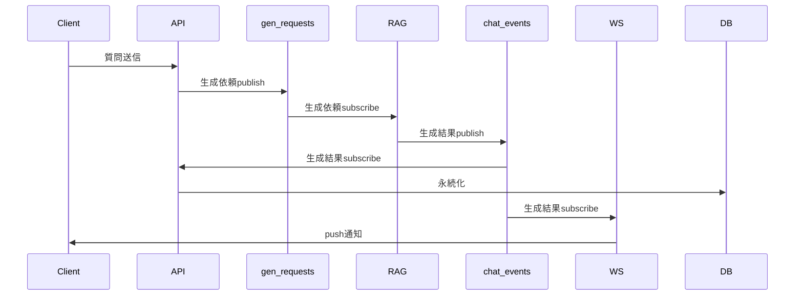

```mermaid
sequenceDiagram
    participant Client
    participant API
    participant Broker_gen as gen_requests
    participant RAG
    participant Broker_chat as chat_events
    participant WS
    participant DB

    Client->>API: 質問送信
    API->>Broker_gen: 生成依頼publish
    Broker_gen->>RAG: 生成依頼subscribe
    RAG->>Broker_chat: 生成結果publish
    Broker_chat->>API: 生成結果subscribe
    API->>DB: 永続化
    Broker_chat->>WS: 生成結果subscribe
    WS->>Client: push通知

```