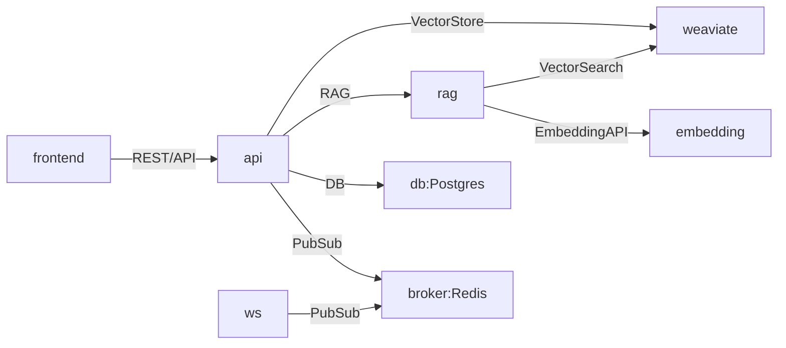

```mermaid
flowchart LR
	frontend["frontend"]
	api["api"]
	db["db:Postgres"]
	broker["broker:Redis"]
	ws["ws"]
	rag["rag"]
	embedding["embedding"]
	weaviate["weaviate"]

	frontend -- REST/API --> api
	api -- PubSub --> broker
	api -- DB --> db
	ws -- PubSub --> broker
	api -- RAG --> rag
	rag -- EmbeddingAPI --> embedding
	rag -- VectorSearch --> weaviate
	api -- VectorStore --> weaviate
```
